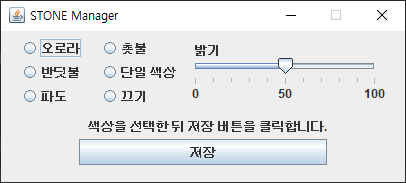
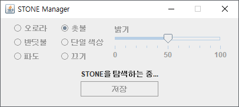
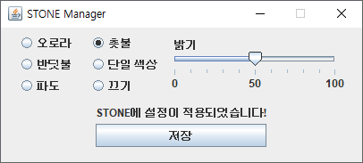
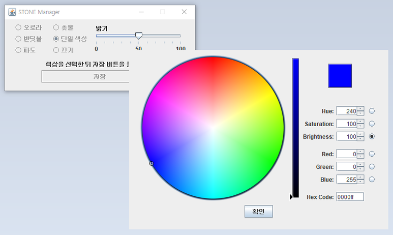

# STONE Manager for Windows

</img>
</img>
</img>
</img>

2016년 Pantech이 출시한 IM-100 스마트폰에 번들로 제공된 블루투스 스피커인 STONE을
Windows에서 제어하고 무드램프를 설정합니다.

***

### 배포 내역
* 2020\. 07\. 개발 시작
* 2020\. 08\. V1\.3\0 배포